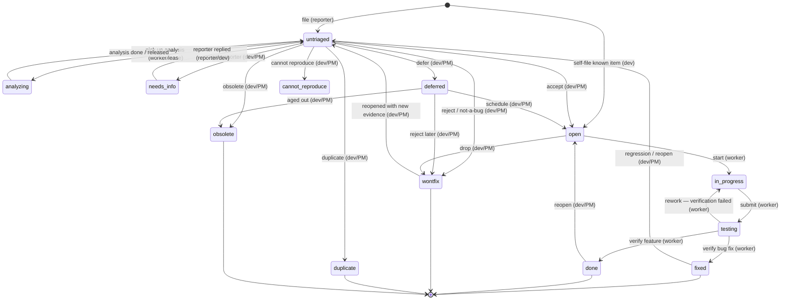

# Standard intake flow (design)

> **Status: APPROVED (2026-08-04).** The user reviewed this design and settled
> every open decision — see [Approved decisions](#approved-decisions-2026-08-04)
> immediately below, which is now authoritative where it differs from a section's
> in-body recommendation. Implementation may proceed against the approved shape.
> This document is the deliverable for issue `standard-intake-flow`. It was
> revised after a four-model critique (`history/review-intake-flow.md`); the
> confirmed findings are folded in, and the choices reviewers disagreed on were
> surfaced as open decisions rather than silently picked.

## Approved decisions (2026-08-04)

The user's calls, authoritative over any differing in-body recommendation:

- **Intake model — reuse the existing `type` enum; do NOT add a `kind`.**
  A bug vs a feature-request is `type: bug` vs `type: feature`. (§1 as written.)
- **Skill names use an `issue-` prefix for clarity:**
  - filing-side `/file-intake` → **`/issue-new`**;
  - processing-side `/intake` → **`/issue-intake`** (this is the one that
    **replaces `/triage-bugs`** and drives `/worktree-bug-analysis`).
  Rename every reference in §4 and elsewhere accordingly.
- **Take the recommended option for every open decision — with ONE exception:
  concurrency is out of scope.** Rationale (the user's): the agentic framework
  that does this work owns its own changes and commits them through git, and the
  calling agent guarantees **each issue travels its own clean path**. There is no
  concurrency problem for the tool to solve, so **no concurrency information is
  stored in any issue**. Concretely:
  - **OD-12 (concurrency — leases & optimistic writes): DROPPED.** No analysis
    lease, no `--expected-version`/CAS requirement on intake writes. The repo-wide
    `flock` that every mutate path already takes remains the only write-safety
    mechanism; that is sufficient.
  - **OD-2 (analysis state): adopt the concurrency-free form.** No `analysis:`
    lease object, **no `owner` / `started` / `lease_until` fields** — those are
    exactly the "concurrency info in the issue" the user rules out. Analysis is a
    **read-only, append-only `## Triage analysis` body section**; any
    "being/has-been analysed" visibility must be *derived* (e.g. presence of that
    section) or omitted, never stored as a lease. If a queryable analysis state is
    still wanted later, it may be a plain status with **no** ownership/lease
    fields — but the default is: no stored analysis state.
  - Every **other** OD (OD-1, OD-3..OD-11, OD-13) → its **recommended option (A)**
    as written in §7.

`issuectl` should own **one** first-class intake flow that handles both **bug
reports** and **feature requests**, filed by a **reporting agent** (or human)
and processed by a **developer / product-manager**. Today intake is ad-hoc: the
Telegram bug path invents its own slug scheme (`tg-bug-<user>-<chat>-<msg-id>`),
its own lifecycle label (`needs-triage`), its own provenance label
(`via:telegram`), and lives entirely in two Claude skills (`/triage-bugs`,
`/worktree-bug-analysis`) rather than in the tool. This design folds all of that
into a single model.

The guiding principle: **lifecycle belongs in `status` (a state the tool can
reason about and validate), not in labels (unenforced free text).** Labels stay
for tagging; the intake *state* becomes first-class.

### A word on "first-class" and what the tool actually enforces

Several reviewers rightly pushed back on an overclaim in the first draft: writing
a flow into the CLI does **not** by itself enforce *who* may drive it or *which*
transitions are legal. Be precise about the three tiers, because the open
decisions below turn on them:

- **Intrinsic invariant** — checked inside the mutation itself, always, even with
  no config. E.g. `intake accept` refuses an already-closed item; `intake file`
  always creates the reception status. This design *recommends* the intake
  mutations carry intrinsic source-state checks (see [OD-9](#od-9-enforcement-model)).
- **Repository policy** — `.issuectl/transitions.yaml`. Opt-in, stricter rules on
  top; absent ⇒ lenient. Good for project-specific gates, **not** a place to hide
  a load-bearing invariant, because a repo without the file loses it.
- **Convention** — persona ownership (§5). The tool has no actor identity today,
  so "the Dev/PM owns the decision" is a *workflow convention* the skills follow,
  not something the binary can enforce. This document does not invent an auth
  model; it says so plainly rather than implying enforcement.

Where the first draft said "the tool owns the flow", read: the tool owns the
**state model and the state-transition invariants**; personas and richer policy
sit above it.

---

## 0. What already exists (build on, don't reinvent)

The machinery this design reuses. Some pieces the ad-hoc flow reimplemented in
skill prose already exist in the binary; a couple of things the first draft
assumed existed do **not**, and are corrected here.

| Capability | Today | Reused for intake as |
| --- | --- | --- |
| Draft staging area | `issues/inbox/<slug>/`, kept out of `ls` | see [OD-1](#od-1-reception-layout) |
| Promote a draft | `issuectl triage [<slug>]` — lists inbox / moves draft → flat | naming collision with the proposed status — see [OD-8](#od-8-reception-status-name--command-collision) |
| Type distinction | `type` enum: `bug`, `feature`, `task`, `improvement`, `chore`, `epic` | **bug vs feature-request** — no new field |
| Lifecycle classes | `status_classes: active \| closing` (schema.rs) | intake states slot into these (but "parked" strains the binary model — [OD-4](#od-4-deferred--parked-lifecycle)) |
| Conditional required fields | `required_when: { status_class: closing }` → `closed:` | reused as-is |
| Enforced transitions | `.issuectl/transitions.yaml` (`allowed_from`/`forbidden_from`, `requires_*`) — **status-only predicates; cannot predicate on `type`** | encodes *part* of the machine ([OD-9](#od-9-enforcement-model)) |
| Structured filing | `issuectl new --type --reporter --label --field --body @file --inbox` | the basis of `intake file` |
| Value coercion in doctor | `status_aliases` / `type_aliases` + `doctor --fix` — **same-field** legacy-value rewrites only | migration needs *new cross-field* logic — §6 |
| Disposition verbs | `close --status`, `update --status`, `set`, `label`, `note`, `depend` | reused inside intake mutations |
| Read-only analysis | `/worktree-bug-analysis` spinoff writes findings into the issue | kept as the engine, driven by `/intake` (§4) |

**Corrections to the first draft (verified against `issuectl --help`):**

- `new` has **no** `--status` flag — creation status is fixed. Good; keep it that
  way ([OD-6](#od-6-guarding-the-filing-path)).
- `new --source` exists but means **"source line for the body"** (e.g.
  `frontend/login`), *not* provenance. Provenance is a genuinely new concept —
  [OD-3](#od-3-provenance) must not overload this flag.
- `status_aliases` coerces one *value* of one field to another value of the *same*
  field. A label→status migration is **new logic** doctor does not have today
  (§6).

The gap is not primitives — it is that **no single, named, validated flow ties
them together**, and that the intake *states* the Telegram path needs
(`needs-triage`, `deferred`) are label-encoded instead of being real statuses.

---

## 1. Intake model — bug vs feature-request

### Recommendation: reuse the existing `type` enum; do **not** add a `kind`.

A bug report and a feature request differ exactly the way `type` already
distinguishes `bug` from `feature`. A parallel `kind` axis would create two
overlapping taxonomies that can disagree, and every query/report would have to
know which to trust.

- **Bug report** → `type: bug`
- **Feature request** → `type: feature`
- Other intake types are legal too: **`improvement`, `chore`, `task`** all arrive
  through the same door (a reporter can file "please rotate the certs" = a task).
  The intake flow is **type-agnostic**; `intake file` accepts any non-`epic`
  type (§3). Only the *terminal disposition* differs by type (a feature is never
  `cannot-reproduce`), and how strictly to enforce that is [OD-9](#od-9-enforcement-model).

**"Intake-ness" is a lifecycle phase, not a type.** Whether an item is *still in
intake* versus *accepted into the backlog* is a question about `status` (§2).
Encoding it as a type or a label (as `needs-triage` does today) is the mistake
this design removes.

### Type may change during triage

The reporter's `type` is a **hint**; the Dev/PM may reclassify (a "bug" that is
really a feature request). Because `type` affects the disposition space,
reclassification is a real triage action, not an edge case — see
[OD-13](#od-13-reclassifying-type-during-triage).

### Provenance and reporter are metadata, not the model

- **Who reported it** → the existing `reporter:` field (`--reporter`).
- **Where it came from** → provenance. Today this is the `via:telegram` label. See
  [OD-3](#od-3-provenance) for the field-vs-label choice, the extensibility of the
  value set, and the separate **external reference** (`source_ref`) that carries
  retry idempotency ([OD-10](#od-10-external-identity--idempotent-filing)).

### Alternatives considered

1. **New `kind` field.** Rejected: duplicates `type`, invites disagreement.
2. **An `intake: true` boolean.** Rejected: derivable from `status`; a field that
   must be kept in sync with `status` is a consistency bug waiting to happen.
3. **Separate `issues/intake/` directory.** Considered via the existing `inbox/`
   — see [OD-1](#od-1-reception-layout). State still lives in `status`; layout is
   only visibility.

---

## 2. Lifecycle state machine

Reception → triage → (analysis) → decision → disposition → closure, each phase
mapped onto a `status` value. New statuses are kept minimal; everything an
existing status already expresses is reused. **Working status names below are
placeholders pending [OD-8](#od-8-reception-status-name--command-collision) and
[OD-11](#od-11-needs-info-lifecycle).**

### States

| Phase | `status` (working name) | class | New? | Meaning |
| --- | --- | --- | --- | --- |
| Reception | `untriaged` | active | **new** | Filed, in the queue, awaiting a triage decision. Replaces the `needs-triage` label. (Name avoids the `issuectl triage` command collision — [OD-8](#od-8-reception-status-name--command-collision).) |
| Analysis | `analyzing` **or** `untriaged`+lease | active | see [OD-2](#od-2-analysis-state) | Under read-only investigation. Whether this is its own status or a lease field is [OD-2](#od-2-analysis-state) — but it is **not** a bare no-op self-transition (first draft's mistake). |
| Awaiting reporter | `needs-info` | active | see [OD-11](#od-11-needs-info-lifecycle) | Filed but un-actionable pending reporter input. Keeps the actionable queue clean. |
| Accepted → backlog | `open` | active | — | Triaged as a real bug / accepted feature; ordinary backlog item. |
| Accepted → parked | `deferred` | active | **new** | Worthwhile but intentionally not scheduled now. Replaces the `deferred` label. Needs a wake-up mechanism — [OD-4](#od-4-deferred--parked-lifecycle). |
| In flight | `in-progress`, `testing` | active | — | Being worked / verified. Owned by the fix worker. |
| Fixed / delivered | `fixed` (bug), `done` (feature) | closing | — | Work complete. Type→terminal mapping is a convention; enforcement is [OD-9](#od-9-enforcement-model). |
| Rejected / not-a-bug | `wontfix` (+ `disposition_reason`) | closing | — | Won't-fix, by-design, out-of-scope — distinguished by a structured reason, not the status — [OD-5](#od-5-disposition-reasons). |
| Cannot reproduce | `cannot-reproduce` | closing | — | Bug we could not reproduce. |
| Duplicate | `duplicate` (+ `duplicate_of`) | closing | — | Directed link to the canonical item — [OD-5](#od-5-disposition-reasons)/§3. |
| Obsolete / superseded | `obsolete` | closing | — | Filed against an already-fixed version, or overtaken by events. A real intake exit, not just an aging bucket. |

Net **new** statuses proposed: **`untriaged`** (required), **`deferred`**
([OD-4](#od-4-deferred--parked-lifecycle)), and possibly **`analyzing`**
([OD-2](#od-2-analysis-state)) and **`needs-info`**
([OD-11](#od-11-needs-info-lifecycle)). Everything else reuses the shipped enum,
including `obsolete`.

### Diagram

Reception, analysis, and every in-flight/reopen edge are shown — the first draft
omitted rework and reopen. Not every closing status is drawn to keep it legible;
the authoritative rules are the transition matrix ([OD-9](#od-9-enforcement-model)).



### Enforcing it — and where the sketch is *not* enough

The first draft claimed the machine was "expressible in `transitions.yaml`
without code changes". That is **only partly true**, and reviewers were right to
call it:

1. `transitions.yaml` predicates are **status-only**. It cannot express "a
   feature completes as `done`, a bug as `fixed`" or "`cannot-reproduce` is
   bug-only" — those are `type × status` rules. Enforcing them needs either a
   code-level invariant in the intake mutations or an accepted relaxation
   ([OD-9](#od-9-enforcement-model)).
2. A partial sketch is a hazard: unless *every* destination is constrained,
   illegal jumps (`untriaged → fixed`, `deferred → in-progress`) stay legal. The
   real artifact must be a **complete transition matrix**, not the illustration
   below.
3. `transitions.yaml` is opt-in; a repo without it loses *all* of this. So the
   invariants that must always hold (you cannot `accept` a closed item; you
   cannot file into a closing status) belong **inside the intake mutations**, not
   only in the YAML — again [OD-9](#od-9-enforcement-model).

Illustrative fragment (NOT the full matrix; reopen paths shown to stay
consistent with the diagram and §5 row 10):

```yaml
version: 1
status_rules:
  open:
    # reachable by accept, by schedule-from-deferred, by reopen, and by
    # direct self-file — do NOT lock allowed_from so tight it forbids reopen.
    forbidden_from: [in-progress, testing]
  deferred:
    allowed_from: [untriaged, open]
  in-progress:
    allowed_from: [open, testing]        # start from backlog, or rework
    requires_assignee: true
  testing:
    allowed_from: [in-progress]
  fixed:
    allowed_from: [testing]
    requires_commits: true
  done:
    allowed_from: [testing]
    requires_acceptance_criteria_checked: true
```

The load-bearing claim is narrow and defensible: **intake state lives in `status`,
and the intake mutations validate the source state.** The exact matrix + the
type-predication question are [OD-9](#od-9-enforcement-model).

### Who may transition (summary; full table in §5)

- **`[*] → untriaged`** — the **filing agent**.
- **analysis** — a **read-only worker**; it enriches the body and takes/releases
  the analysis lease. It does **not** decide disposition.
- **every departure from `untriaged` toward a disposition** — the **Dev/PM**.
- **`open → in-progress → testing → fixed|done`** (and rework) — the **fix
  worker**.
- **reopen** (closing → active) — the **Dev/PM**.

---

## 3. CLI surface

Two audiences, one command namespace. Following `AGENTS-AI-FIRST-CLI.md` and the
`mutate.rs` / thin-handler rule: every verb routes through a function in
`crates/issuectl-core/src/mutate/intake.rs`, and the `cmd_intake_*` handlers in
`main.rs` stay ≤30 lines of arg-parsing + JSON formatting.

### These are domain operations, not "thin aliases"

The first draft called them "thin aliases over the generic verbs". Reviewers were
right that this is the wrong framing: `intake reject` validates the source state,
changes `status`, writes a structured `disposition_reason`, and appends a note —
that is a **single domain mutation with one lock, one validate, one atomic
write**, not a script that chains `set` + `note` (which would risk partial
state: status changed but note lost). The generic verbs (`set`, `close`,
`depend`) and the intake verbs should share the same low-level, lock-free
issue-mutation helpers, but `intake *` is a first-class operation. Whether the
namespace should exist at all is [OD-7](#od-7-intake-namespace-vs-generic-verbs).

### Filing side (reporting agent)

```
issuectl intake file \
  --type bug|feature|improvement|chore|task \
  --title "<one line>" \
  --body @<report-file> \          # or --body "<text>"
  --reporter <who> \
  --provenance <telegram|email|…> \ # NOT --source (that is the body source-line)
  [--source-ref "<external id>"] \  # e.g. chat:123/message:456 — idempotency key
  [--priority low|normal|high] \    # filing-time severity hint (OD-M / below)
  [--slug <descriptive-kebab>] \
  [--label <tag> …] \
  --json
```

- Sets the reception status (`untriaged`) automatically — the filing agent never
  names the entry state.
- **Guarded field surface.** `intake file` does **not** expose raw `--field`;
  protected keys (`status`, `type`, `closed`, `created`, `updated`, `version`,
  `reporter`, provenance) cannot be injected. See
  [OD-6](#od-6-guarding-the-filing-path).
- **Idempotent on `--source-ref`.** A repeat file with the same
  `(provenance, source_ref)` returns the existing item (exit 0, a `deduplicated:
  true` flag) rather than creating a second issue — this replaces the
  retry-idempotency the deterministic `tg-bug-*` slug gave for free. See
  [OD-10](#od-10-external-identity--idempotent-filing).
- **Priority at filing.** A reporter *can* pass a severity hint; the Dev/PM may
  override at accept-time. ("site is down" vs "tooltip typo" is a filing-time
  signal that was missing from the first draft.)
- Strict validation per house rules: empty/whitespace title or body → error;
  unknown provenance → error listing accepted values ([OD-3](#od-3-provenance)
  decides whether that set is fixed or configurable); unknown `--type` → clap
  rejects.

The reporter also gets **`intake withdraw <slug> --reason …`** (`untriaged →
wontfix` with `disposition_reason: withdrawn`) so a mistaken report can be
retracted without filing a second "please close this" report.

### Processing side (developer / PM)

Inspect the queue:

```
issuectl intake queue --json          # default: status:untriaged, stable sort (oldest first)
   [--type bug] [--provenance telegram]
   [--needs-analysis]                 # only items without a completed analysis lease
   [--state deferred|needs-info]      # explicit view of a non-default intake state
issuectl intake show <slug> --json    # item + attachments + analysis section
```

`intake queue` is a projection of the existing query engine. Its JSON output
defines a **stable order** (oldest `created` first) and documents whether
`deferred`/`needs-info` are excluded by default (they are — the default queue is
the *actionable untriaged* set).

Drive the lifecycle (each a first-class domain mutation):

```
issuectl intake accept    <slug> [--assignee <who>] [--priority …]      --json  # → open
issuectl intake defer     <slug> --reason "<why>" [--until <date>]      --json  # → deferred
issuectl intake need-info <slug> --reason "<what's missing>"            --json  # → needs-info
issuectl intake reject    <slug> --reason "<why>" [--kind by-design|wontfix|out-of-scope]  --json  # → wontfix + disposition_reason
issuectl intake cannot-reproduce <slug> --reason "<why>"               --json  # → cannot-reproduce
issuectl intake duplicate <slug> --of <canonical-slug>                 --json  # → duplicate + duplicate_of
issuectl intake obsolete  <slug> --reason "<why>" [--superseded-by <slug>]     --json  # → obsolete
issuectl intake retype    <slug> --to feature                          --json  # reclassify (OD-13)
issuectl intake reopen    <slug> [--to untriaged|open] --reason "<why>"        --json  # closing → active
```

- **Reasons are required** where the first draft made them optional — `defer`,
  `reject`, `cannot-reproduce`, `obsolete`, `reopen` all take a mandatory
  `--reason`, captured as a structured field + a `## Comments` note so the *why*
  is queryable, not buried ([OD-5](#od-5-disposition-reasons)).
- **`duplicate` is directed.** `--of` writes a `duplicate_of: <slug>` field
  (rejecting self-duplicates, missing targets, and cycles), not a symmetric
  `related:` entry.
- **Optimistic concurrency.** Every mutation returns `version`; each accepts an
  optional `--if-version <n>` and fails with a `version-conflict` envelope when
  it does not match, so two Dev/PMs cannot silently clobber each other's decision
  ([OD-12](#od-12-concurrency-analysis-leases--optimistic-writes)).

### Contract compliance

- **No interactive prompts.** Reasons/kinds are flags; no Y/N.
- **Exit codes** per the house contract: `0` success (incl. idempotent
  dedup/no-op); `2` refused-but-actionable (e.g. `accept` on a closed item →
  error envelope); `1` validation/not-found/usage/version-conflict.
- **`--json` everywhere**, error envelope `{"error":{"code","message"}}` on
  stderr with empty stdout. New codes documented: `version-conflict`,
  `transition-illegal`, `duplicate-source-ref`, `protected-field`.

---

## 4. Skill surface

Two shipped skills change hands, plus the **binary-shipped `/issue` skill** that
must stay in sync with any CLI change (the `AGENTS.md` critical rule:
`templates/issue-skill.md` + `templates/issue-prompt.md`, dogfooded via `issuectl
skill install`, enforced by `skill::tests::dogfooded_copies_match_templates`).

### Filing-side skill — `/file-intake` (new, thin)

Replaces the *filing* half the Telegram bot / `file-bug` deterministic filer does
today:

1. Capture the report faithfully (verbatim message + attachments), pick `type`
   as a *hint*, set `reporter`, `provenance`, and `source-ref` (the external
   message id — the idempotency key).
2. Call `issuectl intake file --json`, attach screenshots via `issuectl attach`.
3. Return the slug. **It never triages, decides, or fixes.**

Because filing is now one validated, idempotent CLI call, the deterministic-filer
machinery (ADR 0004/0005) calls the same CLI instead of hand-rolling the
`tg-bug-*` slug + labels.

### Processing-side skill — `/intake` (new) — **replaces `/triage-bugs`, drives `/worktree-bug-analysis`**

One skill the Dev/PM invokes ("check the intake queue", "katso tuliko uusia"):

1. `issuectl intake queue --json` → the untriaged set (bugs **and** features, not
   just `via:telegram`).
2. For each unclear item, drive a **read-only analysis worker**. To resolve the
   first draft's contradiction: `/worktree-bug-analysis` is **kept** as the
   analysis engine (still individually invokable), and `/intake` *drives* it —
   `/intake` does not reimplement analysis. The worker reproduces/locates/
   classifies, appends findings to a `## Triage analysis` section (append-only —
   it never rewrites the reporter's verbatim capture), and takes/releases the
   analysis lease ([OD-2](#od-2-analysis-state)). It changes no application code
   and does not move `status` toward a disposition.
3. Present a PO-language briefing with a per-item recommendation, same register as
   `/triage-bugs` today.
4. **Stop.** The decision + disposition transition are the user's (or
   `/stint`'s), via `issuectl intake accept|defer|reject|…`.

So `/triage-bugs` retires (thin alias during the deprecation window — §6) and
`/worktree-bug-analysis` survives as the driven engine.

### Composition & the `/issue` sync rule

- `/intake` and `/file-intake` **compose** the `issuectl intake` commands; they
  hold no lifecycle logic of their own beyond orchestration and presentation.
- Adding the `intake` group + new statuses/fields **requires** updating
  `templates/issue-skill.md` + `templates/issue-prompt.md` in the same commit,
  then `issuectl skill install --agent all --force`, per the `AGENTS.md` rule (the
  dogfood test enforces it). The two new standalone skills (`/intake`,
  `/file-intake`) need their own install + tests — they are **not** covered by the
  `/issue` dogfood test.

---

## 5. Responsibility split

The heart of the ask: for each step, **who owns it** — as a **convention** the
skills follow (the tool has no actor identity; see the note in the intro and
[OD-9](#od-9-enforcement-model)). Personas: **Reporter** = filing agent/human;
**Dev/PM** = developer / product-manager (may be `/stint` acting for them); a
read-only **Analysis worker** the Dev/PM side drives.

| # | Step / transition | Status change | Owner | Notes |
| --- | --- | --- | --- | --- |
| 1 | Capture the report faithfully | — | **Reporter** | Verbatim message + attachments |
| 2 | Initial type + severity hint | — | **Reporter** | Hints; Dev/PM may override |
| 3 | File the item | `[*] → untriaged` | **Reporter** | `intake file`; sets `reporter`, `provenance`, `source-ref` |
| 3b | Withdraw a mistaken report | `untriaged → wontfix` (`withdrawn`) | **Reporter** | `intake withdraw` |
| 4 | Analyse an unclear item (read-only) | lease only; no disposition | **Analysis worker** | Appends `## Triage analysis`; no code, no decision |
| 5 | Ask reporter for missing info | `untriaged → needs-info` | **Dev/PM** | `intake need-info` |
| 5b | Reporter supplies info | `needs-info → untriaged` | **Reporter/Dev** | Re-enters the queue |
| 6 | Judge & recommend disposition | — | **Dev/PM** (via `/intake`) | Recommendation only |
| 7a | **Accept** → backlog | `untriaged → open` | **Dev/PM** | `intake accept` |
| 7b | **Defer** → parked | `untriaged → deferred` | **Dev/PM** | `intake defer --reason [--until]` |
| 7c | **Reject / not-a-bug** | `untriaged → wontfix` (+reason) | **Dev/PM** | `intake reject --kind …` |
| 7d | **Cannot reproduce** | `untriaged → cannot-reproduce` | **Dev/PM** | bug-only |
| 7e | **Duplicate** | `untriaged → duplicate` (+`duplicate_of`) | **Dev/PM** | directed |
| 7f | **Obsolete / superseded** | `untriaged → obsolete` | **Dev/PM** | `[--superseded-by]` |
| 7g | **Reclassify type** | none | **Dev/PM** | `intake retype` ([OD-13](#od-13-reclassifying-type-during-triage)) |
| 8 | Schedule a parked item | `deferred → open` | **Dev/PM** | `intake accept` |
| 9 | Start / rework / verify | `open → in-progress ⇄ testing → fixed\|done` | **Fix worker** | owns its own status |
| 10 | Reopen a wrongly-closed item | closing → `untriaged`\|`open` | **Dev/PM** | `intake reopen --reason` |

**The single convention worth stating loudly:** the Reporter owns **filing**
(and withdrawing their own report); every *disposition* decision is a Dev/PM
call; the Analysis worker owns **zero** disposition transitions; fix workers own
only the post-acceptance chain. This is the split `/triage-bugs` encodes today,
now expressed against a real state model — but it is enforced by workflow
discipline, not by the binary, until [OD-9](#od-9-enforcement-model) says
otherwise.

---

## 6. Migration

Must not lose in-flight items: open issues with `label: via:telegram` carrying
`label: needs-triage` or `label: deferred`, slug `tg-bug-<user>-<chat>-<msg-id>`,
plus users/skills that invoke `/triage-bugs`.

### Data migration — a purpose-built, dry-run-first pass (NOT a `status_alias`)

Reviewers correctly flagged two things: (a) label→status is **new cross-field
logic**, not the existing same-field `status_alias` coercion, and (b) a blind
rewrite can **regress live or closed issues**. So this is a dedicated migration
(likely `doctor --fix --migrate-intake`, or a one-shot `issuectl intake migrate`),
**dry-run by default**, that refuses ambiguity rather than guessing:

| Legacy state | Action |
| --- | --- |
| `needs-triage` label + `status: open` | → `status: untriaged`, drop label |
| `needs-triage` label + `status: in-progress`/`testing` | **no status change** — drop stale label, warn (item is already being worked) |
| `needs-triage` label + a *closing* status | **no status change** — drop stale label, warn (do not reopen a closed item) |
| `needs-triage` + `deferred` labels together | **conflict — skip, report for manual review** |
| `deferred` label + `status: open` | → `status: deferred`, drop label ([OD-4](#od-4-deferred--parked-lifecycle)) |
| `triaged` label (old "presented" marker) | drop; if the item is otherwise `open` leave it `open` (do **not** silently invent state) |
| `via:telegram` label, no provenance set | → `provenance: telegram` (or keep as label — [OD-3](#od-3-provenance)) |
| `via:telegram` label + provenance already set & conflicting | **conflict — skip, report** |
| `tg-bug-*` slugs | **left untouched** — slug format is not part of the model; rewriting churns every `related:`/`@mention`. (Privacy note: these slugs embed user/chat IDs; remediation via a rename is possible but out of scope — flagged, not silently done.) |

The pass reports what it *would* do, the user runs it for real, and it is
idempotent and per-issue atomic. It never performs a status **regression**
automatically.

### The transitional split queue (must not silently abandon legacy items)

Until a repo runs the migration, new items are `status:untriaged` while old ones
are `status:open + label:needs-triage`, so `intake queue` would *miss the legacy
population*. Mitigation: **`intake queue` also surfaces recognised legacy forms**
(open + `needs-triage`) with a `legacy: true` flag and a one-line "run intake
migration" nudge, until the repo reports migration-complete. The flow does not
rely on the user remembering a one-shot command.

### Skill / workflow migration

- **`/triage-bugs` → thin alias for `/intake`** during a deprecation window
  (prints a "renamed" notice, delegates), so muscle memory and `/stint` call sites
  keep working; removed after the window.
- **`/worktree-bug-analysis`** unchanged in contract; now driven by `/intake`.
- **Deterministic filer (ADR 0004/0005)** switches to `issuectl intake file
  --provenance telegram --source-ref …`.

### Compatibility caveats (the first draft was too glib)

- "Additive statuses can't break anything" is **not** strictly true: new enum
  values can trip exhaustive `match`es, older binaries validating frontmatter,
  external dashboards, and worktrees running a different binary version. The
  rollout order matters: **upgrade readers → migrate schema → add transition
  policy → migrate data → switch filers → enable commands**. Mixed-version
  operation across worktrees should be tested.
- A repo that never adopts `transitions.yaml` still works, but then only the
  *intrinsic* intake-mutation invariants hold ([OD-9](#od-9-enforcement-model)).

---

## 7. Open decisions

Genuine product/design choices for the **user to decide on review**. Each has a
recommendation; none is silently baked in. OD-1..OD-7 are revised from the first
draft; OD-8..OD-13 were surfaced by the review.

### OD-1: Reception layout — flat `status: untriaged` vs `inbox/` draft

- **A (recommended):** Reception is a **flat issue with `status: untriaged`** —
  immediately in the tracker, queryable, analysable. Add an explicit
  **`intake file --draft`** for the genuine pre-tracker case (half-formed capture,
  scanner candidates) that lands in `inbox/` and is promoted into `untriaged`.
- **B:** Reception is always an **`inbox/` draft**; promotion sets `untriaged`.
  Keeps untriaged items out of `ls` entirely; splits "promoted" from "decided".
- **Trade-off / follow-through the first draft ducked:** under A, `list` shows
  untriaged items unless filtered — so either `list` gains a default filter that
  hides `untriaged` (a behaviour change to assess) or users filter explicitly.
  And **`scan-todos --create-inbox` and the existing `inbox/` concept must be
  reconciled** with A, not left as a parallel zombie queue. **Recommend A** with
  `--draft` covering the pre-tracker need and a decision on the `list` default.

### OD-2: Analysis state — `analyzing` status vs `untriaged` + lease field

The first draft's "activity within `untriaged`, no state" is withdrawn: it
contradicts the doc's own thesis and gives no concurrency story.

- **A (recommended):** A structured **`analysis:` lease** in frontmatter
  (`{state, owner, started, lease_until}`) on an `untriaged` item. The queue
  filters `--needs-analysis` on it; a stale lease is reclaimable; a completed
  analysis that lands *after* a disposition is detectably late. Keeps the status
  enum small while making analysis a real, queryable, concurrency-safe state.
- **B:** A first-class **`analyzing`** status. Simplest to query; but it is a
  status a *worker* owns (mild tension with "workers own zero intake
  transitions"), and it still needs the lease fields for concurrency.
- **Recommend A** — it solves the actual problem (leasing, stale/late detection),
  not just visibility. Either way, **the body is append-only** for analysis.

### OD-3: Provenance — new `provenance:` field vs label; and how extensible

Note the corrected fact: `--source` is taken (body source-line), so provenance
needs a new name (`--provenance`).

- **A (recommended):** A first-class **`provenance:` field**, value set
  **configurable per repo** (schema-declared), not a hard-coded closed enum —
  because sources (Slack, GitHub webhook, phone notes) expand and the tool is
  repo-driven. Optionally an `other` value + `provenance_detail:` free text.
- **B:** Keep it a **label** (`provenance:telegram`, replacing `via:telegram`).
  Zero schema change; weaker structure.
- **Separate but linked:** the *external reference* (`source_ref`, e.g.
  `chat:123/message:456`) is not the same as provenance and carries idempotency —
  [OD-10](#od-10-external-identity--idempotent-filing).
- **Recommend A with a configurable value set** (a hard-coded enum was the first
  draft's mistake).

### OD-4: `deferred` / parked lifecycle — status, and a wake-up mechanism

- **A (recommended):** A new **`deferred` active status** **plus a wake-up field**
  (`deferred_until:` / `review_after:`), so parked items are not a graveyard —
  `intake queue --state deferred --due` can resurface them.
- **B:** `deferred` as a **label** on `open`. No schema change; weaker semantics.
- **C:** `open` + `priority: low`. Conflates parked with low-priority; loses the
  "high-priority but can't schedule now" case.
- **Also to decide:** the binary `active|closing` `status_class` model has no
  "parked/inactive" class, so a `deferred` item still counts as *active* in every
  workload/backlog rollup. Options: accept that, add a third `parked` class (a
  `status_classes` change with conditional-field implications), or have consumers
  exclude `deferred` explicitly. **Recommend A + require `deferred_until`**, and
  decide the class question deliberately.

### OD-5: Disposition reasons — structured `disposition_reason` vs status proliferation

All four reviewers rejected the first draft's "reuse `wontfix` for everything,
reason lives in a prose note" (it re-buries the *why* in unenforced free text —
the exact anti-pattern).

- **A (recommended):** Keep the small closing enum (`wontfix`, `cannot-reproduce`,
  `duplicate`, `obsolete`) **and add a structured `disposition_reason:` field**
  (`by-design | out-of-scope | wontfix | withdrawn | superseded | …`, enum) plus an
  optional free-text note. Queryable metrics ("by-design rate" vs "resource
  starvation") without enum bloat.
- **B:** Add distinct **closing statuses** (`not-a-bug`, `by-design`). More enum
  values to classify; coarser than a reason field.
- **Recommend A** — the metrics signal reviewers care about lives in a structured
  reason, not in more statuses or in prose.

### OD-6: Guarding the filing path (was "does `new` gain `--status`")

- **Recommended:** `new` keeps **no `--status`** (creation status stays
  constrained), and **`intake file` does not accept raw `--field`** — it exposes a
  fixed, safe flag set and **rejects protected keys** (`status`, `type`, `closed`,
  `created`, `updated`, `version`, `reporter`, `provenance`). Without this the
  "always `untriaged`, reporter can't spoof" guarantees are hollow (`--field
  status=fixed` would bypass them).
- **Alternative:** allow `--field` with an allowlist. Weaker; more surface for an
  untrusted filer to poke.
- **Recommend the guarded surface.**

### OD-7: `intake` namespace vs generic verbs only

- **A (recommended):** Ship the **`intake` group** as first-class domain
  operations (§3 — each one transactional, sharing low-level helpers with the
  generic verbs). Self-describing, discoverable, matches "the tool owns the state
  model".
- **B (reviewer minority, worth surfacing):** **No new commands** — `/intake`
  composes `new`/`set`/`close`/`depend`. One canonical mutation path; smaller
  surface; but the flow is legible only in skill prose, and enforcement of intake
  invariants has nowhere to live.
- **Recommend A**, explicitly *not* as aliases: if both an intake verb and a
  generic verb can reach the same state, they must call the **same** validated
  helper so they cannot drift.

### OD-8: Reception status name & the `issuectl triage` command collision

Not flagged in the first draft; all four reviewers caught it.

- **A (recommended):** Name the reception status **`untriaged`** (or `received` /
  `unreviewed`) — verb-free, no clash with the `issuectl triage` command.
- **B:** Keep `status: triage` and **rename the command** to `issuectl inbox
  promote` (or `draft promote`).
- **Recommend A** (less disruptive than renaming a shipped command), with the
  exact token (`untriaged` vs `received`) the user's call.

### OD-9: Enforcement model — intrinsic invariants vs configurable policy vs advisory

The most important decision the first draft hid.

- **A (recommended):** The **intake mutations carry intrinsic source-state
  invariants** (cannot `accept` a closed item; cannot file into a closing status;
  cannot start work from `untriaged`) that hold **with or without**
  `transitions.yaml`; the YAML adds *stricter* repo policy on top. Generic `set
  status` routes through the same validators so it is not a bypass.
- **B:** All transition rules live only in `transitions.yaml` (today's model);
  a repo without it is fully lenient. Simplest; but "first-class" is then a
  misnomer.
- **Plus a sub-decision:** `type × status` rules (feature→`done`, bug→`fixed`,
  `cannot-reproduce` bug-only) **cannot** be expressed in status-only
  `transitions.yaml`. Either add a code-level `type/status` compatibility check
  or accept these as advisory conventions. **Recommend A + a code-level
  type/status check**, or an explicit decision to keep them advisory.

### OD-10: External identity & idempotent filing

Abandoning the deterministic `tg-bug-*` slug (§3) removes the retry-idempotency
it gave for free.

- **A (recommended):** `intake file` takes **`--source-ref`**; uniqueness is
  scoped by **`(provenance, source_ref)`**. A retry with the same pair returns the
  existing issue (idempotent success), or a `duplicate-source-ref` conflict —
  the filer never creates accidental duplicates on crash/retry.
- **B:** No external identity; rely on random slugs + later manual `intake
  duplicate`. Simpler; accepts duplicate-on-retry.
- **Recommend A.**

### OD-11: `needs-info` / waiting-on-reporter lifecycle

- **A (recommended):** A **`needs-info` active status** for filed-but-un-actionable
  items awaiting reporter input, so the actionable `untriaged` queue stays clean;
  optionally auto-nudge/auto-close after N days of reporter silence.
- **B:** Keep such items in `untriaged` (status quo — noisy queue) or reject them
  as `cannot-reproduce` (too aggressive).
- **Recommend A.**

### OD-12: Concurrency — analysis leases & optimistic writes

- **A (recommended):** (i) analysis uses the lease from
  [OD-2](#od-2-analysis-state); (ii) every intake mutation supports
  **`--if-version`** optimistic concurrency so two Dev/PMs cannot silently clobber
  each other; (iii) the design acknowledges that the repo **flock only serialises
  same-filesystem processes** — separate worktrees/machines can still produce git
  merge conflicts on append-only notes, so analysis appends to a *dedicated*
  section to stay merge-friendly, and cross-worktree conflicts are a normal,
  resolvable outcome, not a bug.
- **B:** Ignore concurrency; rely on the flock. Fragile once `/worktree-*` fan-out
  spawns parallel workers.
- **Recommend A.**

### OD-13: Reclassifying `type` during triage

- **A (recommended):** An explicit **`intake retype <slug> --to <type>`** (Dev/PM),
  valid only while the item is in an intake state, so the bug/feature hint can be
  corrected before disposition (it affects the disposition space).
- **B:** Use generic `set <slug> type …`; no intake-specific guard.
- **Recommend A** (guarded, auditable).

---

## Appendix: summary of proposed changes (for the implementation phase, once approved)

Nothing below is implemented by this document — it is the shape the approved
design would take, contingent on the open decisions.

- **schema.rs:** add `untriaged` (active) and, per the ODs, `deferred` /
  `analyzing` / `needs-info` (active) to the `status` enum + `status_classes`
  (and possibly a `parked` class — OD-4); add `provenance:` (OD-3),
  `disposition_reason:` (OD-5), `duplicate_of:`, `source_ref:`, `deferred_until:`,
  and an `analysis:` lease object (OD-2). Update
  `default_schema_enums_match_field_consts`.
- **mutate/intake.rs (new):** `file`, `accept`, `defer`, `need_info`, `reject`,
  `cannot_reproduce`, `duplicate`, `obsolete`, `retype`, `reopen`, `withdraw` —
  each one lock → validate (intrinsic source-state invariant, OD-9) → mutate →
  atomic write, sharing low-level helpers with the generic verbs; `--if-version`
  optimistic check.
- **main.rs:** thin `cmd_intake_*` handlers + a clap `Intake` subcommand group.
- **transitions.yaml (default):** a *complete* intake transition matrix (OD-9),
  plus any code-level `type/status` compatibility check.
- **migration:** dedicated dry-run-first cross-field pass (§6); `intake queue`
  legacy-form surfacing.
- **skills:** ship `/file-intake` and `/intake` (with their own install + tests);
  retire `/triage-bugs` (alias); keep `/worktree-bug-analysis` as the driven
  engine.
- **templates/issue-skill.md + issue-prompt.md:** document the new commands,
  statuses, and fields (the `AGENTS.md` sync rule), then `skill install --agent
  all --force`.
</content>
